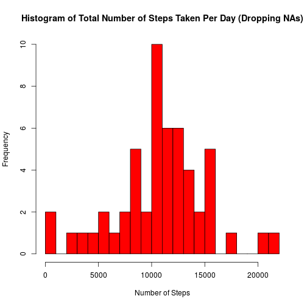
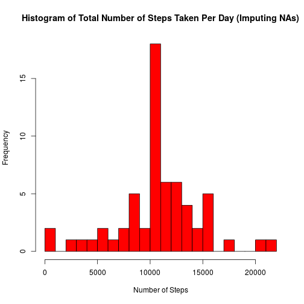
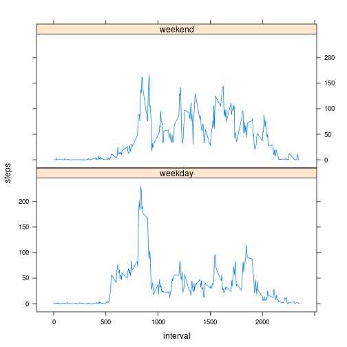

## Loading and preprocessing the data

* Load the data (i.e. read.csv())

```r
setwd("/home/wshao/school/coursera/RepData-015/Proj01/RepData_PeerAssessment1")
unzip("activity.zip")
df <- read.csv("activity.csv")
```

* Process/transform the data (if necessary) into a format suitable for your analysis


```r
# Baseline the data frame to a version that omits the rows with NA values
sdf <- na.omit(df)
```

## What is mean total number of steps taken per day?

* Calculate the total number of steps taken per day

```r
library(plyr)
sdfByDay <- ddply(sdf, .(date), numcolwise(sum))
sdfByDay[,c(1:2)]
```

```
##          date steps
## 1  2012-10-02   126
## 2  2012-10-03 11352
## 3  2012-10-04 12116
## 4  2012-10-05 13294
## 5  2012-10-06 15420
## 6  2012-10-07 11015
## 7  2012-10-09 12811
## 8  2012-10-10  9900
## 9  2012-10-11 10304
## 10 2012-10-12 17382
## 11 2012-10-13 12426
## 12 2012-10-14 15098
## 13 2012-10-15 10139
## 14 2012-10-16 15084
## 15 2012-10-17 13452
## 16 2012-10-18 10056
## 17 2012-10-19 11829
## 18 2012-10-20 10395
## 19 2012-10-21  8821
## 20 2012-10-22 13460
## 21 2012-10-23  8918
## 22 2012-10-24  8355
## 23 2012-10-25  2492
## 24 2012-10-26  6778
## 25 2012-10-27 10119
## 26 2012-10-28 11458
## 27 2012-10-29  5018
## 28 2012-10-30  9819
## 29 2012-10-31 15414
## 30 2012-11-02 10600
## 31 2012-11-03 10571
## 32 2012-11-05 10439
## 33 2012-11-06  8334
## 34 2012-11-07 12883
## 35 2012-11-08  3219
## 36 2012-11-11 12608
## 37 2012-11-12 10765
## 38 2012-11-13  7336
## 39 2012-11-15    41
## 40 2012-11-16  5441
## 41 2012-11-17 14339
## 42 2012-11-18 15110
## 43 2012-11-19  8841
## 44 2012-11-20  4472
## 45 2012-11-21 12787
## 46 2012-11-22 20427
## 47 2012-11-23 21194
## 48 2012-11-24 14478
## 49 2012-11-25 11834
## 50 2012-11-26 11162
## 51 2012-11-27 13646
## 52 2012-11-28 10183
## 53 2012-11-29  7047
```

* Make a histogram of the total number of steps taken each day


```r
hist(sdfByDay$steps, breaks = 20, main = "Histogram of Total Number of Steps Taken Per Day (Dropping NAs)", xlab ="Number of Steps", col = "red")
```

 

* Calculate and report the mean and median total number of steps taken per day


```r
mean(sdfByDay$steps)
```

```
## [1] 10766
```


```r
median(sdfByDay$steps)
```

```
## [1] 10765
```

_The mean is 10766 and the median is 10765._

## What is the average daily activity pattern?

* Make a time series plot (i.e. type = "l") of the 5-minute interval (x-axis) and the average number of steps taken, averaged across all days (y-axis)


```r
# Group by interval
sdfByInterval <- ddply(sdf, .(interval), numcolwise(mean))
plot(sdfByInterval$interval, sdfByInterval$steps, type = "l", main = "Average Daily Activity Pattern", ylab ="Number of Steps", xlab = "Interval")
```

 

* Which 5-minute interval, on average across all the days in the dataset, contains the maximum number of steps?


```r
sdfByInterval[sdfByInterval$steps == max(sdfByInterval$steps), ]
```

```
##     interval steps
## 104      835 206.2
```

_The 8:35am to 8:40am interval averages the highest number of steps._

## Imputing missing values

* Calculate and report the total number of missing values in the dataset (i.e. the total number of rows with NAs)


```r
sum(is.na(df) == TRUE)
```

```
## [1] 2304
```

* Devise a strategy for filling in all of the missing values in the dataset. The strategy does not need to be sophisticated. For example, you could use the mean/median for that day, or the mean for that 5-minute interval, etc.

_The strategy is to use the mean number of steps for each of the 5-minute intervals across all days to fill in the missing data in the frame._

* Create a new dataset that is equal to the original dataset but with the missing data filled in.


```r
# We plan to make a temporary data frame by repeating sdfByInterval by nd times so that it
# matches with the dimension of df, where nd is the number of days in the data set.
nd <- nrow(df) / nrow(sdfByInterval)
tdf <- sdfByInterval[rep(seq_len(nrow(sdfByInterval)), times=nd),]
df$steps <- ifelse(is.na(df$steps), tdf$steps, df$steps)
```

* Make a histogram of the total number of steps taken each day and calculate and report the mean and median total number of steps taken per day. Do these values differ from the estimates from the first part of the assignment? What is the impact of imputing missing data on the estimates of the total daily number of steps?


```r
dfByDay <- ddply(df, .(date), numcolwise(sum))
hist(dfByDay$steps, breaks = 20, main = "Histogram of Total Number of Steps Taken Per Day (Imputing NAs)", xlab ="Number of Steps", col = "red")
```

 


```r
mean(dfByDay$steps)
```

```
## [1] 10766
```


```r
median(dfByDay$steps)
```

```
## [1] 10766
```

_Because of the strategy used for imputing the data, the histogram looks essentially the same as the one for dropping the missing data. For the same reason, the affected mean total number of steps taken per day is the same, while the median total number of steps taken per day is merely one step more than the number obtained after dropping the missing data._

## Are there differences in activity patterns between weekdays and weekends?

* Create a new factor variable in the dataset with two levels – “weekday” and “weekend” indicating whether a given date is a weekday or weekend day.


```r
df$doe <- ifelse((weekdays(as.Date(as.character(df$date))) == "Sunday") | (weekdays(as.Date(as.character(df$date))) == "Saturday"), "weekend", "weekday")
df$doe <- as.factor(df$doe)
```

* Make a panel plot containing a time series plot (i.e. type = "l") of the 5-minute interval (x-axis) and the average number of steps taken, averaged across all weekday days or weekend days (y-axis). See the README file in the GitHub repository to see an example of what this plot should look like using simulated data.


```r
# Add the raw minutes column for this data frame
mdf <- ddply(df, .(doe, interval), numcolwise(mean))
# Use the lattice system for plotting this
library(lattice)
xyplot(steps~interval|doe, data=mdf, type="l", layout=c(1,2))
```

 
